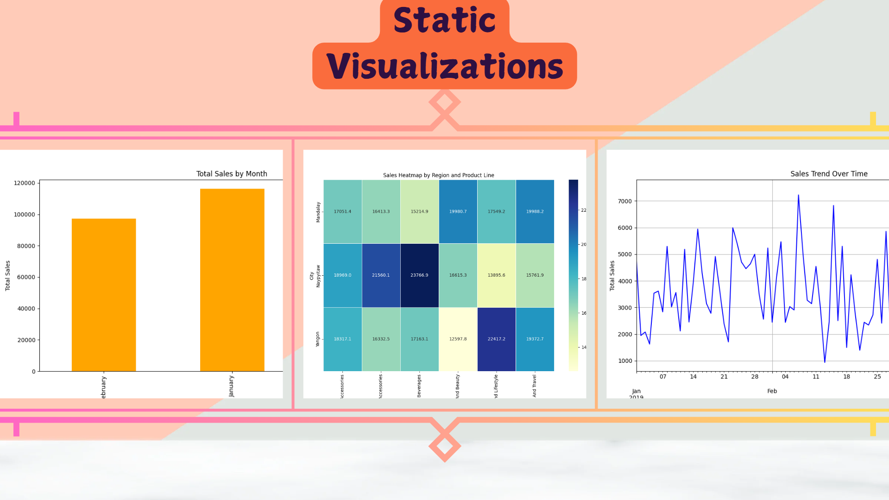

---

# **Retail Sales Analytics Dashboard**

## **Overview**
The **Retail Sales Analytics Dashboard** is a comprehensive data analytics application designed to preprocess, analyze, and visualize retail sales data. It also provides an interactive dashboard for exploring sales trends, customer behavior, and product performance. This application is styled with the Indian tricolor theme (saffron, white, and green) to celebrate its identity.

## **Features**
1. **Data Preprocessing**:
   - Handles missing values, duplicates, and standardizes the dataset for analysis.
   - Creates additional time-based features for granular insights (e.g., Hour, Day, Month).

2. **Data Analysis**:
   - Computes key metrics such as total sales, average sales, sales by region, and sales by product.
   - Provides insights into customer behavior and payment distribution.

3. **Static Visualizations**:
   - Generates line charts, bar plots, and heatmaps to summarize sales trends.
   - Saves visualizations as static images for easy reporting.

4. **Interactive Dashboard**:
   - Allows users to filter data by date, city, product line, and gender.
   - Displays dynamic charts such as sales trends, product performance, payment distribution, and hourly sales patterns.
   - Enables exporting filtered data for further analysis.

---

## **Project Structure**
```
Retail_Sales_Analytics/
├── data/
│   ├── sales_data.csv             # Raw sales data (input)
│   └── cleaned_sales_data.csv     # Cleaned data after preprocessing
├── visualizations/                # Folder for generated static visualizations
├── outputs/                       # Folder for exported filtered data
├── logs/                          # Folder for log files
├── scripts/
│   ├── load_and_preprocess_data.py # Data preprocessing module
│   ├── analysis.py                 # Data analysis module
│   ├── static_visualizations.py    # Static visualization module
│   └── dash_app.py                 # Interactive dashboard module
├── app.py                         # Main application entry point
├── requirements.txt               # Python dependencies
├── README.md                      # Project documentation
```

---

## **Technologies Used**
1. **Programming Language**:
   - Python 3.8 or higher

2. **Libraries**:
   - **Data Manipulation**: `pandas`, `numpy`
   - **Visualizations**: `matplotlib`, `seaborn`, `plotly`
   - **Dashboard**: `Dash`, `dash-bootstrap-components`
   - **Logging**: `logging`

3. **Styling**:
   - Indian tricolor theme (saffron, white, green).

---

## **Setup Instructions**

### **1. Clone the Repository**
```bash
git clone https://github.com/MasteriNeuron/Retail-Sales-Analytics.git
cd retail-sales-analytics
```

### **2. Create & Activate a Virtual Environment**
```bash
conda create -n venv python=3.11 -y
conda activate venv/
```

### **3. Install Dependencies**
```bash
pip install -r requirements.txt
```

### **4. Add Your Data**
- Place the raw sales data file (`sales_data.csv`) in the `data/` directory.
- Ensure the file has the required columns: `Date`, `City`, `Product line`, `Total`, `Quantity`, `Payment`, `Gender`, etc.

---

## **How to Run the Application**

### **1. Preprocessing**
Automatically cleans and preprocesses the raw data.
```bash
python app.py
```

### **2. Automated Workflow**
Running `app.py` automates the following:
1. Preprocesses raw data and saves cleaned data to `data/cleaned_sales_data.csv`.
2. Analyzes the cleaned data and outputs key metrics in the console.
3. Generates static visualizations and saves them in the `visualizations/` folder.
4. Launches the interactive dashboard on `http://localhost:8050`.

### **3. Access the Dashboard**
- Open your browser and navigate to [http://localhost:8050](http://localhost:8050) to access the interactive dashboard.

---

## **Key Dashboard Features**
1. **Filters**:
   - Date Range
   - City
   - Product Line
   - Gender

2. **Key Metrics**:
   - Total Sales
   - Gross Income
   - Total Quantity Sold
   - Average Rating

3. **Dynamic Visualizations**:
   - Sales Trend Over Time
   - Product Performance
   - Payment Method Distribution
   - Customer Type Analysis
   - Hourly Sales Patterns

4. **Export Data**:
   - Allows exporting the filtered data as a CSV file.

---

## **Outputs**

### **1. Static Visualizations**
Generated static visualizations include:
- **Sales Trend Over Time** (Line Chart)
- **Sales Heatmap by Region and Product Line** (Heatmap)
- **Sales by Month** (Bar Chart)


### **2. Interactive Dashboard**
The dashboard provides:
- Interactive filtering.
- Real-time updates to charts and metrics.
- Export functionality.

---

## **Error Handling**
- All processes (preprocessing, analysis, visualization, dashboard) include error handling with detailed logging.
- Logs are saved in the `logs/` directory for debugging purposes.

---

## **Known Issues**
- Ensure the `sales_data.csv` file contains all required columns to avoid preprocessing errors.
- Port conflicts may occur if another application is using port `8050`. In such cases, modify the `app.run_server` call in `app.py`:
  ```python
  app.run_server(debug=True, port=8051)
  ```

---

## **Future Enhancements**
1. Add user authentication for dashboard access.
2. Enhance data visualization with more advanced plots.
3. Extend support for multi-file data preprocessing.
4. Deploy the application on a cloud platform (e.g., AWS, Heroku).

---
## **License**
This project is licensed under the MIT License.

---
